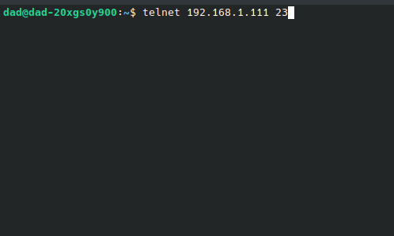
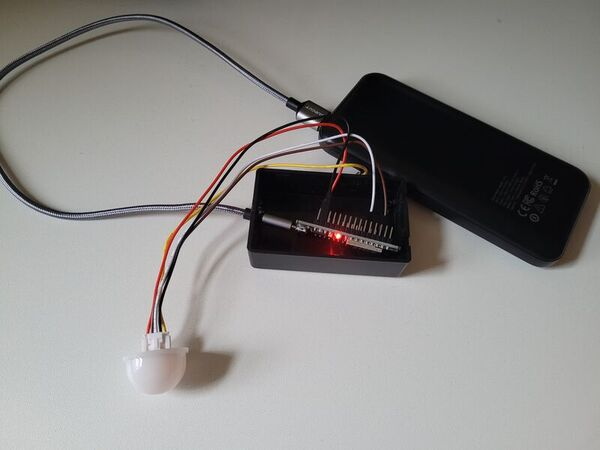

# MALT (Matt’s Awesome Light Tracker)
*Light-exposure logger for ESP32 + BH1750*

---

## Project overview
MALT flashes onto an ESP32 microcontroller that's been wired to a BH1750 light sensor.
Within a user-defined time window, it:

* Samples ambient light at 2-second intervals
* Counts how many seconds lux levels were ≥ 20k (direct light)
* Streams each reading live over telnet
* Concludes with a summary (ex. Total direct sunlight: 3 hours, 42 minutes, and 18 seconds)

Can be used with multiple boards in tandem. Each device auto-connects via Wi-Fi, grabs NTP time, and identifies itself with a compile-time DEVICE_ID.

Project difficulty: 1/5 (Beginner friendly)

---

## Why make this?

My wife was worried her plants weren't getting enough direct sunlight. So, like any good husband, I taught myself basic embedded systems engineering and made a little gizmo to ease her fears.

---

## Components

Hardware

* ESP32 microcontroller
* BH1750 light sensor
* 1000mAH power bank (overkill, but it was on sale)
* Plastic chassis (5x3x2 inches or larger)

Software

* Firmware (main.cpp file)
* PlatformIO (Esperssif32 & Arduino)
* Libraries (BH1750 Claws, WiFi)
* CLion (or any compatible IDE)

---

## Build & flash

1. Clone the repo
2. Open in your IDE with the PlatformIO plugin installed
3. Edit the **(SSID, PASS, RUN_TIME, DEVICE_ID)** values in `main.cpp`
4. Hit **Build → Upload** (or `pio run -t upload`)
5. Open **Serial Monitor** at 9600 baud; you should see Wi-Fi and NTP messages

To watch live data

In your terminal, enter:  `telnet <board-ip> 23`
